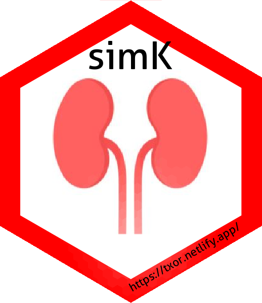

<!-- README.md is generated from README.Rmd. Please edit that file -->

```{r, echo = FALSE}
knitr::opts_chunk$set(
  collapse = TRUE,
  comment = "#>",
  fig.path = "man/images/"
)
```

# simK 

[](https://www.repostatus.org/#active)

**License**: Creative Commons Attribution [CC-BY](https://creativecommons.org/licenses/by/2.0/). Feel free to share and adapt, but don't forget to credit the author. :sunglasses:


:dart: Functions to procedurally generate synthetic data in R for kidney transplant simulations.

`simK` allows to generate data with clinical and demographic information for a pool of simulated cadaveric donors and simulated wait listed candidates for kidney transplantation.

Data generated with `simK` are particularly useful on [KARS](https://balima.shinyapps.io/kars/).

> :warning: This package is not a medical device and <ins>should not be used for making clinical decisions</ins>.

## Instalation

### Development version 

The development version can be installed from GitHub, if you want all the latest features, together with all the latest bugs and errors. You have been warned :exclamation:

```
# install from GitHub
devtools::install_github("balima78/simK")
```

## Main functions

This package has 3 main functions, with them we can generate simulated data for a pool of donors, a set of kidney transplant candidates and the respective HLA-antibodies for those patients HLA sensitized.

### Donors

A data frame with information for a pool of simulated donors can be generated with the function `donors_df()`:

```
library(simK)
# you must run also tidyverse
library(tidyverse)

donors_df(n = 10, 
          replace = TRUE, 
          probs = c(0.4658, 0.0343, 0.077, 0.4229), 
          lower = 18, upper = 75, mean = 55, sd = 15, 
          uk = FALSE, 
          n_seed = 3)
          
# A tibble: 10 x 10
   ID    bg    A1    A2    B1    B2    DR1   DR2     age DRI  
   <chr> <chr> <chr> <chr> <chr> <chr> <chr> <chr> <dbl> <chr>
 1 D1    B     1     29    8     44    11    7        40 D2   
 2 D2    A     2     3     7     57    4     8        54 D4   
 3 D3    O     11    33    14    35    1     13       51 D3   
 4 D4    A     24    30    49    58    11    11       74 D4   
 5 D5    A     2     3     7     51    1     13       72 D4   
 6 D6    O     30    68    15    18    3     4        59 D3   
 7 D7    A     3     26    18    40    11    13       46 D2   
 8 D8    O     1     1     7     8     3     13       71 D4   
 9 D9    A     3     3     7     44    15    8        70 D3   
10 D10   A     11    29    44    57    7     7        69 D4 
```

For a given number of rows `n`, a data frame is generated with columns: 

  + *ID* unique identifier with the prefix 'D'; 
  + *bg* with the blood group generated from the parameter `probs` a vector with the probabilities for groups A, AB, B and O, respectively; 
  + *A1*, *A2*, *B1*, *B2*, *DR1*, *DR2* HLA typing obtained from HLA allelic and haplotipic frequencies previously published by [Lima *et al*, 2013](https://www.slideshare.net/balima78/lima-2013) (with `replace = TRUE` we can generate a data frame without limitations on the number of rows);
  + *age* generated from a Normal distribution with `mean` and `sd` given by the user, values truncated by `lower` and `upper` boundaries;
  + *DRI* when option `uk = TRUE`, Donor Risk Index is copmputed as described by [transplantr](https://transplantr.txtools.net/articles/kidney_risk_scores.html) 
  
defining `n_seed` allows for reproducibility.

:information_source: to compute *DRI* as decribed on `{transplantr}`, we generated variables: *height* ($N(165,20)$); *hypertension* (with probability $0.43$); *sex* (with probability $0.55$ for man); *CMV+* (with probability $0.9$); hospital stay ($P(\lambda = 4)$); and [*GFR* by *age*](https://www.kidney.org/atoz/content/gfr) (<30 $N(116,10)$; 30-39 $N(107,10)$; 40-49 $N(99,10)$; 50-59 $N(93,10)$; 60-69 $N(85, 10)$; >=70  $N(75, 10)$) 

### Candidates

A simulated waiting list for kidney transplant candidates, can be generated with `candidates_df()`:

```
candidates_df(n = 10, 
              replace = TRUE,
              probs_abo = c(0.43, 0.03, 0.08, 0.46),
              probs_cpra = c(0.7, 0.1, 0.1, 0.1),
              lower = 18, upper = 75, mean = 45, sd = 15,
              prob_dm = 0.12,
              uk = TRUE,
              n_seed = 3)
              
# A tibble: 10 x 14
   ID    bg    A1    A2    B1    B2    DR1   DR2     age dialysis  cPRA Tier     MS RRI  
   <chr> <chr> <chr> <chr> <chr> <chr> <chr> <chr> <dbl>    <dbl> <dbl> <chr> <int> <chr>
 1 K1    A     1     29    8     44    11    7        36       49     0 B         1 R2   
 2 K2    O     2     3     7     57    4     8        21       22     0 B         7 R4   
 3 K3    A     11    33    14    35    1     13       26       55    21 B         2 R1   
 4 K4    O     24    30    49    58    11    11       37       98     0 A         8 R2   
 5 K5    O     2     3     7     51    1     13       47       89     0 A         3 R3   
 6 K6    A     30    68    15    18    3     4        25       22     0 B         4 R4   
 7 K7    O     3     26    18    40    11    13       56       79     0 B         5 R4   
 8 K8    A     1     1     7     8     3     13       72       81    90 A        10 R4   
 9 K9    O     3     3     7     44    15    8        47       65    60 B         9 R3   
10 K10   O     11    29    44    57    7     7        30       42     0 B         6 R1    
              
```

For a given number of `n` rows, a data frame is generated with columns: 

  + *ID* unique identifier with the prefix 'K'; 
  + *bg* with the blood group generated from the parameter `probs_abo` a vector with the probabilities for groups A, AB, B and O, respectively (here by default, we assumed group O patients are more frequent); 
  + *A1*, *A2*, *B1*, *B2*, *DR1*, *DR2* HLA typing obtained from HLA allelic and haplotipic frequencies previously published by [Lima *et al*, 2013](https://www.slideshare.net/balima78/lima-2013) (with `replace = TRUE` we can generate a data frame without limitations on the number of rows);
  + *age* generated from a Normal distribution with `mean` and `sd` given by the user, values truncated by `lower` and `upper` boundaries;
  + *dialysis* time on dialysis **in months**, values computed according to patients' blood group and hypersensitation status (cPRA > 85%): for patients with blood group O **and** Hypersinsitized time on dialysis obtained from N(85, 20); for those patients blood O **or** Hypersinsitized $N(70,20)$; remaining patients have time on dialysis obtained from $N(35,20)$;
  + *cPRA* patients are classified in groups with probabilities given by `probs_cpra` for 0%, 1%-50%, 51%-85% and 86%-100%, respectively. Within the groups > 0%, cPRA are computed as random values from distributions $P(\lambda = 30)$, $P(\lambda = 70)$ and $P(\lambda = 90)$;
  + *Tier* patients are classified in two Tiers as described on [POL186/11 – Kidney Transplantation: Deceased Donor Organ Allocation](https://nhsbtdbe.blob.core.windows.net/umbraco-assets-corp/22127/pol186.pdf) from UK transplant. In Tier A are patients with MS = 10 or cPRA = 100% or time on dialysis > 7 years, all remaing patients are classified as Tier B;
  + *MS* matchabilily score are the deciles obtained from the number of donors on dataset `D10K` that are a match to each transplant candidate. [This score takes into account a patient’s blood type, HLA type and cPRA value. A patient with a MS = 1 is defined as easy to match and a MS = 10 as difficult to match.](https://www.odt.nhs.uk/odt-structures-and-standards/odt-hub-programme/kidney-offering-scheme/#:~:text=blood%20group%20match-,Key%20terms,10%20as%20difficult%20to%20match)
  + *RRI* when option `uk = TRUE`, Recipient Risk Index is copmputed as described by [transplantr](https://transplantr.txtools.net/articles/kidney_risk_scores.html). To compute RRI, variables age, time on dialysis (in days) and the probability of being diabetic (obtained from `prob_dm`) are used. Also, we assumed all patients were on dialysis at time of listing.
  
defining `n_seed` allows for reproducibility.

### HLA antibodies

the function `Abs_df()` allows to generate a data frame with HLA antibodies from a candidates waiting list:

```
Abs_df(candidates = candidates_df(n=10), 
       n_seed = 3)
       
# A tibble: 49 x 2
   ID    Abs  
   <chr> <chr>
 1 K3    A25  
 2 K3    DR4  
 3 K8    A25  
 4 K8    DR16 
 5 K8    A33  
 6 K8    B51  
 7 K8    B48  
 8 K8    DR16 
 9 K8    B52  
10 K8    B55  
# ... with 39 more rows
```

as inputs, this function requires a data set with an *ID* and patients HLA information (HLA typing and cPRA value) with the same format as provided  by `candidates_df()`. Defining `n_seed` allows for reproducibility.

:warning: 
All these functions rely on HLA typing at intermediate resolution as described at  [Lima *et al*, 2013](https://www.slideshare.net/balima78/lima-2013).
:warning:
